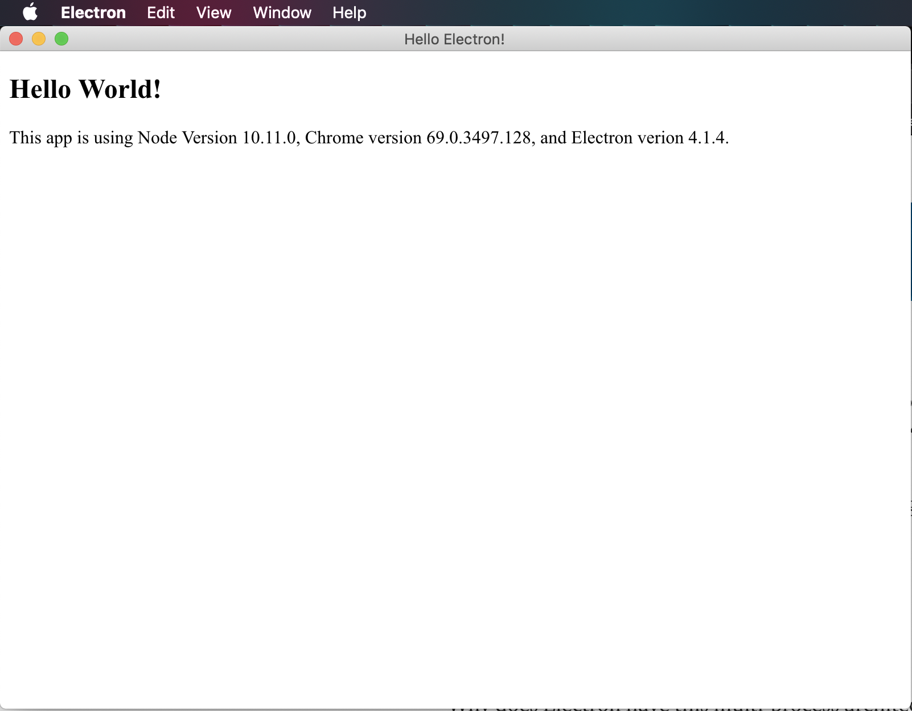

# Electron in Production
This repo will demonstrate how to build and distribute a basic electron app.

Official documentation for electron can be found [here](https://electronjs.org/docs/tutorial/first-app).

The official documentation describes how to construct a node application from scratch, here I'm just going to use the `npm init` command to build the `package.json` and associated dependencies.

## Getting Started

Getting started with Electron is fairly easy. In your project directory run the command.

```
$ npm init
```

Fill out the terminal prompts with the appropriate information.

You should see a new `package.json` file in your project directory.

We'll have to edit the `package.json` file slightly in order to use Electron for our Node App.

You should see a new file that looks like this.

```
{
  "name": "production-electron-tutorial",
  "version": "1.0.0",
  "description": "This is a demo of a basic Electron application.",
  "main": "index.js",
  "scripts": {
    "test": "echo \"Error: no test specified\" && exit 1"
  },
  "repository": {
    "type": "git",
    "url": "git+https://github.com/JSitter/production-electron-tutorial.git"
  },
  "keywords": [
    "Electron"
  ],
  "author": "Justin Sitter",
  "license": "MIT",
  "bugs": {
    "url": "https://github.com/JSitter/production-electron-tutorial/issues"
  },
  "homepage": "https://github.com/JSitter/production-electron-tutorial#readme"
}
```

This file is missing a start script that can start our Electron app. For a regular Node app you would add `"start": "node .",` to start the development server.

For our app however, we don't want to use Node -- we want Electron.

Add the following start script to the `package.json` file.

```
...
  "scripts": {
    "start": "electron .",
    "test": "echo \"Error: no test specified\" && exit 1"
  },
...
```

At this point we need to install Electron into our dev dependencies.

Use `npm install --save-dev electron` to add this dependency to your project.

Now your project is set up with electron, now you just have to interact with Electron's API to build your app.

## Creating Your Electron App

Now we just have to create our index.js file.

```
touch index.js
```

Electron must be imported into this project at the beginning. The following line will allow access to all electron API calls.

```
const electron = require('electron');
```

We're going to use a different import line however so just keep this in mind.

## Electron Processes

Electron uses web technologies to build applications that run across a myriad of platforms. Electron imposes a separation between the main and renderer processes in your application. There's a great article by [Cameron Nokes](https://medium.com/cameron-nokes/deep-dive-into-electrons-main-and-renderer-processes-7a9599d5c9e2) that explains more about this separation.

For now just know that this separation allows us to have apps that can do operations without blocking the UI, but it also means that occasionally we may have to deal with interprocess communication (IPC) to hand data back and forth between processes.

Interprocess communication is beyond the scope of this tutorial, but keep in mind that different browser windows can pass information back and forth using IPC if you ever find yourself in need of this feature.

## Add the Application Contents

Lets create a new app and browser window to run our simple example in.

```
const { app, BrowserWindow } = require('electron')

function newWindow () {
  // Create new Chromium browser window.
  let window = new BrowserWindow({ width: 800, height: 600 })

  // Load index.html into new browser window.
  window.loadFile('index.html')
}

app.on('ready', newWindow)
```

## Add the HTML File

There is still one last file to write before we can run our app. We'll need to add an HTML file in order for Chromium to render our app.

Create an `index.html` file in your project's root folder.

Inside should be this markup.

```
<!DOCTYPE html>
<html lang="en">
<head>
  <meta charset="UTF-8">
  <meta name="viewport" content="width=device-width, initial-scale=1.0">
  <meta http-equiv="X-UA-Compatible" content="ie=edge">
  <title>Hello Electron!</title>
</head>
<body>
  <h2>Hello World!</h2>
  This app is using Node Version <script>document.write(process.versions.node)</script>,
  Chrome version <script>document.write(process.versions.chrome)</script>,
  and Electron verion <script>document.write(process.versions.electron)</script>.
</body>
</html>
```

Once the html file is saved you'll be ready to run your new fancy Electron app.

Use this command to start your new app.

```
$ npm start
```

You should see the app window pop open on your screen.



You should notice that when your app starts it seems that you got a few things for free. For one, we have a menu bar that we didn't define. Our menu bar has functions that we would expect such as Undo, Copy, Cut, Paste, Fullscreen,  etc. There's even an about menu for our app that we didn't create. 

This menubar is handy to start with but as you build out your application you'll want to make your own custom application menu.

## Debugging Electron
Since your electron app is running using different processes there are a couple places to look for debugging output. The terminal that is used to launch the app ( i.e. where you type in the command `npm start`) will output any console logs in your main process, but not anything that happens in the renderer process.

Try adding `console.log("This is the main process")` to the bottom of the  `index.js` file. Then add a script to the bottom of your body tag in `index.html`.

```
... Here is the code that already existed ...

  <script>console.log("Logging from the renderer process")</script>
</body>
</html>
```

If you run `npm start` you'll see the log 'This is the main process' appear, but the other log does not.

In order to see our other log to the console you'll have to visit the application window go to the View menu and select "Toggle Developer Tools"

You should see your familiar browser debugging tools. Click on the 'Console' button to see our log.

In order to productionize your app you'll want to take care of the additional warning logs that show up as well. I won't do that here right now to keep things simple.

## Templating Engines

There are a few npm modules that allow for templating with Electron. Checkout [electron-handlebars](https://www.npmjs.com/package/electron-handlebars) or [electron-pug](https://github.com/yan-foto/electron-pug) to use those engines. 

## Electron Resources
Check out some of these samples to get further inspiration or to read more about the features of Electron.
- [Boilerplate and CLI](https://electronjs.org/docs/tutorial/boilerplates-and-clis)


## Distribution
You have a local app that can do amazing things, but how do you distribute that app?

Well stay tuned for the next episode.